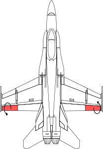



This is the personal site of Daniel N. Miller. It's mostly a landing page
for my software and publications. Check out my
[Linkedin](http://www.linkedin.com/in/dmiller0/) page for a bio and job
history.

## Research
My research is on system identification, or the construction of dynamic
models from measured data. I'm currently focusing on methods that robustly
handle large datasets, such as those typically seen in structural and
thermodynamic analysis. I'm also interested in robust control and
control-oriented identification.

## Academic Projects

These are some of the more fruitful projects I worked on in academia.

### Identification of Aeroelastic Modes for an F/A-18

Many aircraft capable of reaching transonic speeds (between 0.7 and 0.9
times the speed of sound) suffer from some sort of reduced maneuverability
in this part of the flight envelope. This is due to airflow separation over
the ailerons, which control the roll of the aircraft. The ailerons are the
outside, trailing-edge control surfaces shown below.

To investigate maneuverability of light-weight, flexible aircraft at
transonic speeds , NASA Dryden FRC replaced the wings on an F/A-18 with a
novel wing design that uses leading-edge control surfaces to actively modify
the airflow across the wing surface. The change in airflow causes the wing
to bend in a way that reattaches flow over ailerons. More information about
the Active Aeroelastic Wing F/A-18 can be found on the plane's [Wikipedia
page](http://en.wikipedia.org/wiki/Boeing_X-53_Active_Aeroelastic_Wing).

This project identified the aeroelastic modes of the Active Aeroelastic Wing
F/A-18 for flutter analysis in collaboration with NASA researchers. In order
to guarantee consistent estimates, the models were identified using
statistical measures of input-output data. This resulted in the development
of some novel ID methods and software tools that are currently being used in
the aerospace industry. See the [RBIS](https://github.com/dnmiller/rbis)
toolbox and publications page for theoretical details.

### Fault Detection in Integrated Circuits

The dynamic thermal response of integrated circuits is typically represented
as a system of lumped time constants, and changes in these time constants
imply attachment defects in the circuit. The standard way of detecting
changes in time constants for ICs is to deconvolve the measured thermal step
response with some time-domain shaping function and empirically compare the
"spectra" of two responses. This can be problematic for noisy data, since
the deconvolution operation can dramatically amplify high-frequency noise,
decreasing the quality of the model.

Working with Vektrex in San Diego, we developed a novel method based on
classical linear system realization theory to identify the time-constants of
the thermal response of an integrated circuit for use in fault detection.
The method provides parametric models of arbitrarily high order without
deconvolution or differentiation. See the
[Stepalize](http://www.github.com/dnmiller/Stepalize) software package for
an implementation and check out the [IEEE journal
paper](https://dl.dropbox.com/u/31688552/Pubs/2012_Miller_IEEE_TCPMT.pdf)
for theoretical details.
