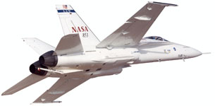
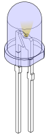



This is the personal site of Daniel N. Miller. It's mostly a landing page
for my software and publications. Check out my
[Linkedin](http://www.linkedin.com/in/dmiller0/) page for a bio and job
history.

## Research
My research is on system identification, or the construction of dynamic
models from measured data. I'm currently focusing on methods that robustly
handle large datasets, such as those typically seen in structural and
thermodynamic analysis. I'm also interested in robust control and
control-oriented identification.

## Academic Projects

These are some of the more fruitful projects I worked on in academia.

### Identification of Aeroelastic Modes for an F/A-18

This project identified the aeroelastic modes of the Active Aeroelastic Wing
F/A-18 for flutter analysis in collaboration with NASA Dryden. In order to
guarantee consistent estimates, the models were identified using statistical
measures of input-output data. This resulted in some novel ID methods and
software tools that are currently being used at multiple companies in the
aerospace industry. See publications page for details.

### Fault Detection in Integrated Circuits

The dynamic thermal response of integrated circuits is typically represented
as a system of lumped time constants, and changes in these time constants
imply attachment defects in the circuit. The standard way of detecting
changes in time constants in ICs is to deconvolve the measured thermal step
response and compare the "spectra" of two responses.

Working with Vektrex in San Diego, we developed a novel
step-based-realization (SBR) method to identify the time-constants of the
thermal response of an integrated circuit for use in fault detection. The
method provides parametric models of arbitrarily high order without
deconvolution or differentiation. See the Stepalize software package and
check out the publications for theoretical details.
